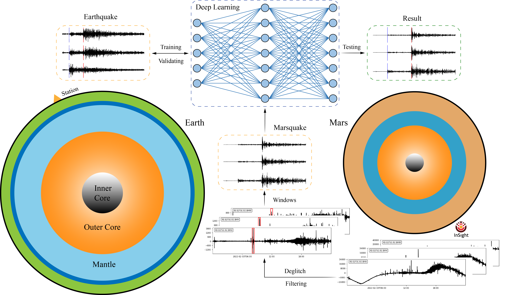

# Detection of Marsquakes on InSight data using deep learning

## MANet Architecture

  

## 1. Download:

* Download ➡️ [data](https://drive.google.com/drive/folders/12jCbBQCb9HbqhpyhJ1vd-YsN_31ziPVb?usp=drive_link), put it into the **data** folder.
* Download ➡️ [snapshots](https://drive.google.com/drive/folders/1xGBKv4L_GDxl0mpriAQpCv3Yv62zvMPr?usp=drive_link), put it into the **snapshots** folder.

## 2. Test

* Run `python test.py`.

### ⚡ We will subsequently release additional code.

